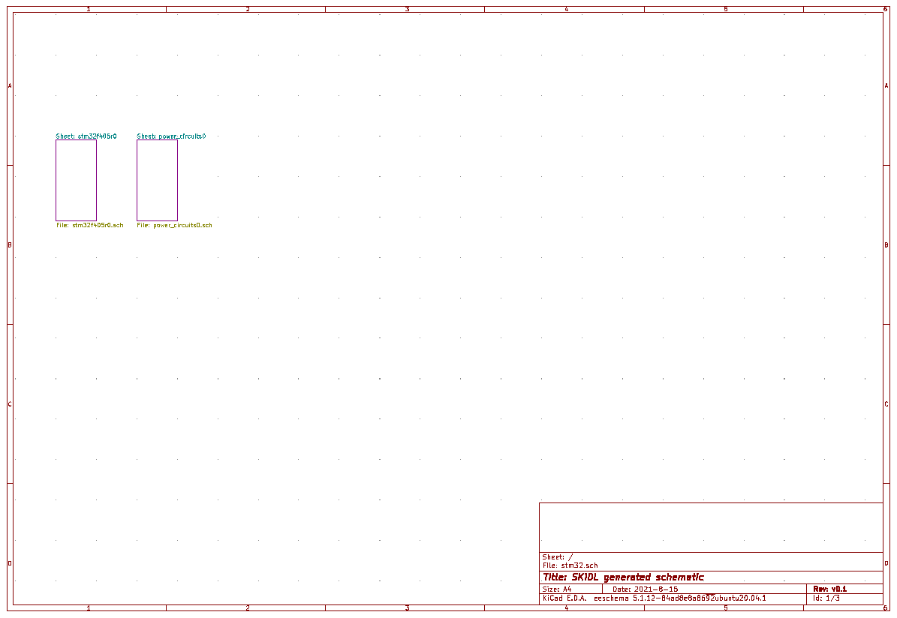
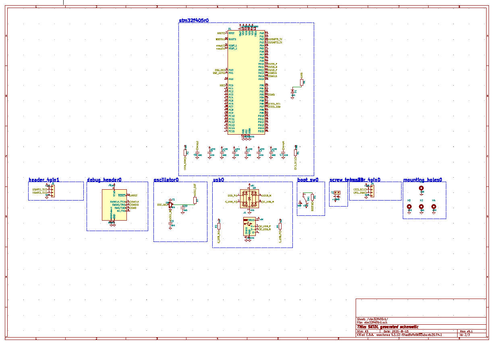
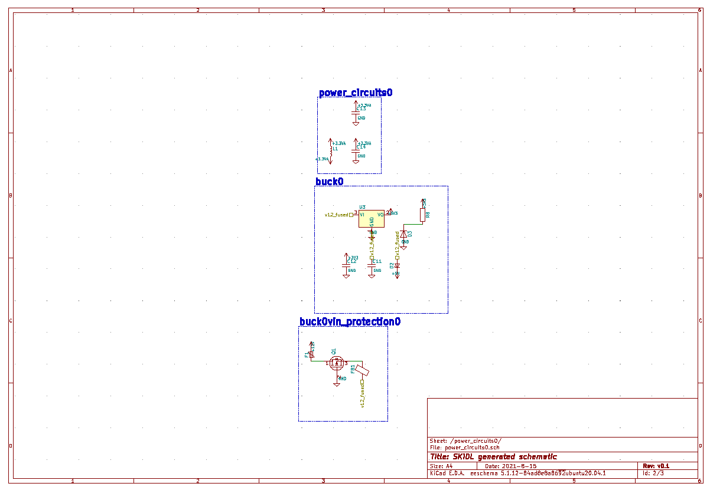
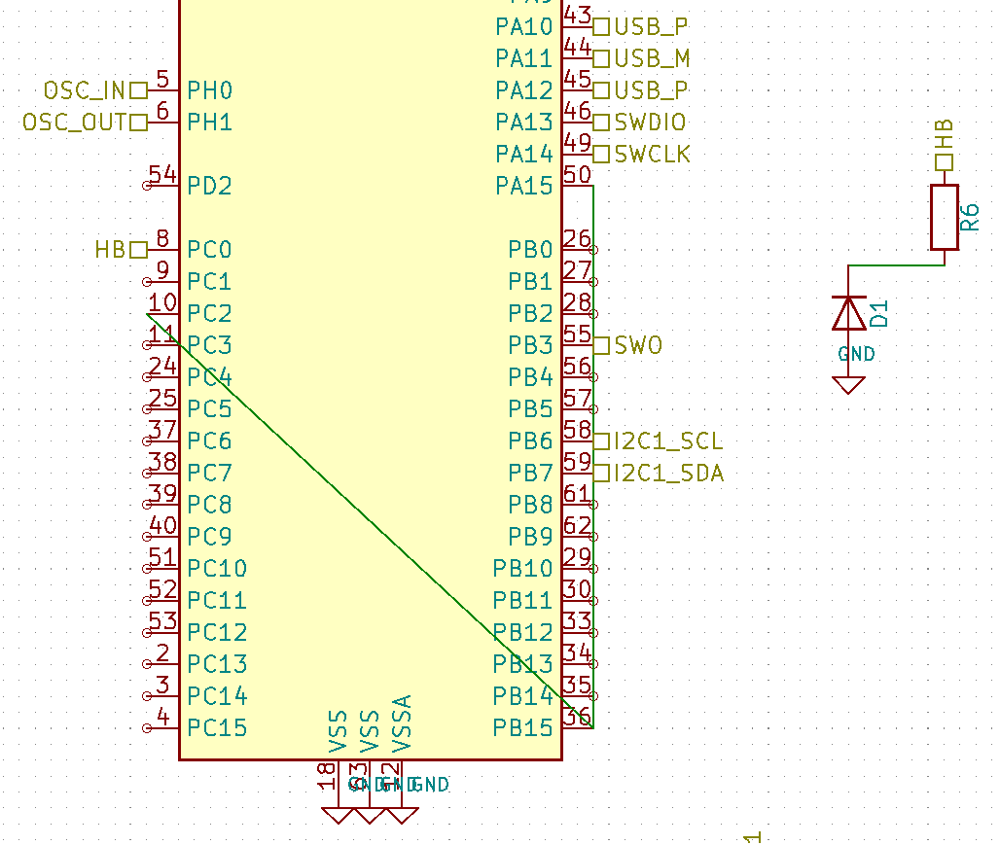
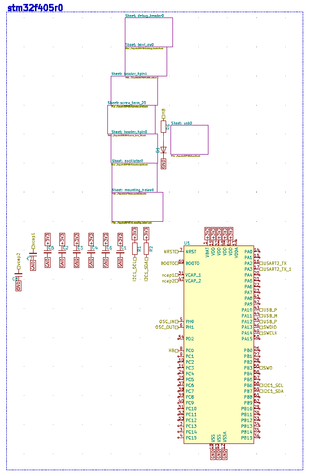
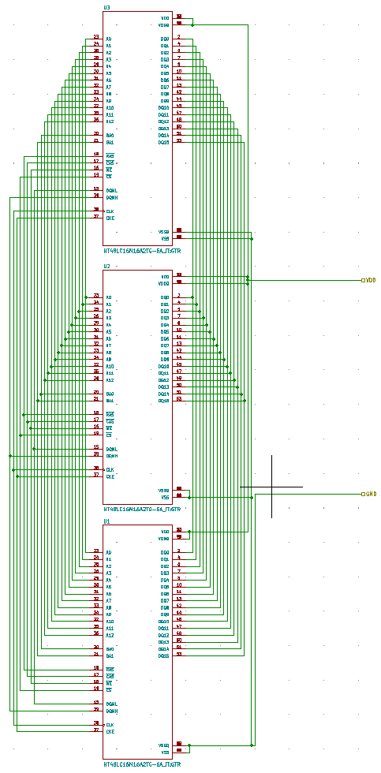

Title: SKiDL Has Schematics!
Status: draft
Author: Dave Vandenbout
Tags: schematics
Summary: You can finally generate schematics from your SKiDL code.

The most frequently-asked question after [my talk about SKiDL at KiCon in 2019](https://www.youtube.com/watch?v=WErQYI2A36M)  
was "Can it output schematics?"
Quite disappointing since the whole point of SKiDL is to avoid schematics!
But people want what they want, and maybe outputting schematics
would help with the adoption of SKiDL if people could see what their code was generating.

But I didn't want to write the code for this because I knew it was *hard!*
Hard not just in the sense that it would have to intelligently place part symbols and route
wires between them, but hard because the final result had to be *aesthetically pleasing*.
(People are ~~anal~~ exceedingly picky about their schematics!)
So even after a ton of work, everyone might say it's shit.

So 2019 passed and I didn't work on it.
And not in 2020, either.
And 2021 looked like it was going to be a bust *until somebody else did it for me!*
In August, [Shane Mattner](https://github.com/shanemmattner) released an initial version
that could convert SKiDL code into a KiCad schematic.
By the time he stopped to pursue a new job, his code was able to create hierarchical
schematics like this:

There were a number of limitations with this initial version:
* The first part was arbitrarily selected as the anchor in each schematic page,
  and then the rest of the parts were arranged around that.
* Only simple connections between parts were routed.
* Multi-unit parts weren't handled.
* Etc...
 
But these were incidental to the main point:
*the code could actually create KiCad-compatible schematics!*

Since Shane was on to bigger things, it was up to me to push forward with it.
I couldn't just ignore it.
A couple of months of refactoring and it would be ready for a general release.
How hard could it be, right?

Well, let's see how that turned out...

## Nov - Dec, 2021: Refactoring

I started with basic housekeeping by implementing some geometric primitives
like transformation matrices, points, vectors, bounding boxes, etc.
I used these to rewrite pieces of the code that were handling part placement
and wiring with ad-hoc calculations.
I probably could have pulled in an existing Python package to do this, but
many of those have dropped support for Python 2 and I was still supporting that
so...

Next, since SKiDL is intended to serve as a front-end for multiple EDA packages,
I started to separate the KiCad-specific pieces of the code from the generic
schematic-generation pieces.
This partitioning also makes it easier to support the various versions of KiCad.
(The schematic generation code development started when KiCad 5 was the current version,
but now it's KiCad 7.)

For handling hierarchy,
the original code parsed information stored in SKiDL `Part` objects.
I decided to make an explicit tree-like `Node` object that stores the schematic parts
at each level of the hierarchy while maintaining links to child nodes at lower levels.
This made it easier to manipulate entire sheets of the schematic such as the
bounding box, placement, or how the hierarchy was expressed, either as linked subsheets
or as blocks of circuitry within the parent sheet.

While no new features were added during this phase, I made extensive modifications
to the original code.
It was a big help to have Shane's test examples so I could verify my code was
producing the same results as his.

## Jan - May, 2022: Routing

As 2022 began, it became clear that the existing routing code was too limited.
It could handle simple point-to-point wires, but failed on anything more
complicated.
For example, the routing shown below is for a connection I added between
pins `PA15`, `PB15`, and `PC2` of the STM32 microcontroller:

The wires fail to avoid the net stub labels on pins `PB6` and `PB7` and
then actually cross over the STM32 symbol.

Note that the wire between parts `R6` and `D1` has no such problems because the
placement code tries to align pins so they can be connected by
a straight wire.
But, most often, that isn't possible.

So I decided to implement a more robust routing solution
that runs through the following phases on each node of the circuit hierarchy:
1. Generation of coarse routing cells between the parts in each node.
2. Global routing of nets between part symbol pins through the coarse cells.
3. Assignment of global routes to fixed terminals on the periphery of each routing cell.
4. Detailed switchbox routing of nets between the terminals of each routing cell.
5. Concatenation of detailed switchbox routes for each net to create a complete end-to-end wire.

The figure below depicts the results of running these phases on a particular node:

Horizontal and vertical edges are extended from each corner of a part's bounding box
(the green rectangles) to form an irregular matrix of coarse routing cells.
Note that there are a lot of cells even for a node with few parts, and some of them can
be quite small in one or both dimensions.

The edges of each cell are labeled with the number of global routes that can pass through them, as
determined by the length of the edge and the spacing allowed between wire traces
(KiCad has a default schematic wiring grid of 50).
The edge count is reduced for each global route that passes through it, and no route is allowed
through once the count reaches zero.
This prevents the formation of an unroutable mess by keeping too many routes from using the same cell.

Each global route starts from an edge of a cell containing a pin of a net.
The route segments fan out from this edge to the other edges of the cell that have non-zero edge counts.
The endpoint of each segment is labeled with the
[Manhattan distance](https://algodaily.com/lessons/what-is-the-manhattan-distance)
from the center of the source edge to the center of the destination edge and
is then placed into a priority queue.
The segment with the smallest endpoint distance is selected from the queue and the fan-out process
is repeated with each added segment labeled with the sum of the selected segment and the length 
of the new segment.
In this way, the search spreads preferentially from the segment closest to the starting edge.
When the search encounters an edge containing another pin of the net, then a global route
with minimal total length has been found.
If there are more pins on the net that have yet to be connected, then the search begins fanning out
from the edge of the just-found pin (with a starting distance of zero) as well as the remaining edges
in the priority queue.

If there are multiple nets, then they are globally routed in order of their lengths with the 
shortest nets first.
I reasoned that shorter nets where the pins are closer together would have fewer options for
routing connections than longer nets.

Once all global routes are selected, the ends of each route segment have to be assigned to terminals
on the wiring grid along the edges of the cells.
You can see the final global route for a net as the thin, black edges connecting the brown
terminal points in the figure above.

Once the terminal points for each net are assigned to the edges of each cell,
a [Greedy switchbox router.](https://doi.org/10.1016/0167-9260(85)90029-X) is used to create the
detailed routing within each cell.
This is simple for the single net in the figure above, but gets much more
complicated as multiple nets criss-cross each cell.

Finally, all the detailed routes in each cell are concatenated to form complete routes
for each net (the brown edges in the figure above).

The fully-routed schematic for this example is shown below:

Near the end of the router development, I noticed a problem: some of the 
switchbox cells were tiny and difficult to route because they weren't wide enough for even a single wire.
So I added a phase to *coalesce* smaller switchboxes into larger ones by circulating around
their N, W, S, and E edges, merging with surrounding cells until a part bounding box
or the routing boundary were encountered.
I also removed any switchboxes without global routes since they didn't need detailed routing.
The result of applying this procedure is shown below:

## June - August, 2022: Placement

With the router working, I began to develop the code for placing schematic parts.
I partitioned the placer into several phases that proceeded from the bottom-most leaf node
up to the top node of the hierarchy:
1. Expansion of part bounding boxes to allow room for routing.
2. Grouping of node parts into those that are connected and floating.
3. Force-directed placement of the parts within each group into blocks.
4. Arranging the blocks to create the overall placement for the node.

The innermost bounding box for a part includes the pins and any additional graphic elements.
Some of the pins may be attached to *stub nets*, so labels for the net names are attached to the
respective pins, thus expanding the part bounding box some more. Finally, the box is expanded further
on each side depending upon how many pins are connected to non-stub nets. For example,
if a part had ten pins connected to non-stub nets on its left side, then the left side of the
bounding box would be pushed out by five wire trace widths to allow some room for routing to
those pins.
(The number of trace widths to allocate for a number of pins is an ad-hoc parameter I selected,
but 0.5 seems to work, more or less.)
After all this, even if the part bounding boxes were abutted to each other, there would still
be no overlaps of the parts, their pins, or stub net labels while still leaving room for routing.

A part within a node can be considered to be *connected* if it has an explicit wire to another part,
or *floating* if it's pins only attach to stub nets (such as a bypass capacitor attached to Vdd and ground).
A *connected group* is just a bunch of connected parts where there a path between any two parts through
some intervening parts and/or nets.
There can be multiple connected groups within a node's parts (or even none at all).
A *floating group* is just a collection of all the floating parts, and there can only
be one such group (or none at all).

The parts in either group are moved using
[force-directed placement](https://www.wikiwand.com/en/Force-directed_graph_drawing)
where attractive forces pull the parts together while repulsive forces push them apart.
For a connected group, the attractive forces are exerted by the nets that connect them and
the repulsive forces result from any overlap of their bounding boxes.
The floating group is the same except, since there are no connecting nets, the attractive
force is based upon the similarity of the parts (e.g., part types and values).

There are many ways to compute an attractive force from a net connecting two pins, but the
most obvious is to use the vector between the two pins and multiply it by some scaling factor.
For a pin that connects to multiple pins on other parts, then the forces are calculated individually
and summed together.
The total force on a part is then the summation of the forces on each of its pins.
A floating part with no net connections use a variant of this by having pseudo-nets from its
attachment point to all the attachment points on the other
floating parts along with weights that are proportional to the similarity between the parts.

Repulsive forces arise when the bounding boxes of parts overlap.
The force between two overlapping parts is proportional to and in the same direction as
the smallest movement in the X or Y direction that would remove the overlap.
If a part overlaps more than one other part, then the individual repulsive forces are summed.

During placement, the movement of each part is influenced by the weighted sum of its attractive
and repulsive forces as follows:

> `total_force = (1-alpha) * attractive_force + alpha * repulsive_force`

At the start of placement, `alpha = 0` and the attractive forces pull all the parts together
so the interconnecting nets are short and there are many overlaps.
Then `alpha` is incrementally increased, causing the part overlaps to decrease while the
net lengths increase.
Finally when `alpha = 1`, all the forces are repulsive and the parts should be non-overlapping
while the nets should still be somewhat short.
An animation of this part placement evolution is shown below:

After the placement evolution completes, the final phase is to *nudge* the parts so their pins
align with the wiring grid.

Once all the parts within the connected and floating part groups are placed,
each block of parts is arranged using the same attractive/repulsive force scheme.
In this case, since there are no interconnecting nets, the attractive force is based upon a 
measure of similarity between the blocks while overlap of the blocks generates the
repulsive force.
A result of placing blocks this way is shown below.

Quite frankly, the block placement doesn't look great.
But it was time to move on...

## September - December, 2022: Integration

At this point, I *thought* I was ready to release the schematic generation code by year's end.

My first task was to integrate the placement and routing phases, which wasn't too difficult.

Then the KiCad EESCHEMA file had to be generated from the placed and routed circuit, which
exposed a problem.
When all this started at the end of 2021, KiCad version 5 was the current release and
the code reflected that.
Now, KiCad 6 was the current release with KiCad 7 on the near horizon, but the
schematic generation code was still oriented toward KiCad 5.
And my KiCad software had been updated to version 6 and no longer worked with my code.
I tried installing side-by-side versions of 5 and 6, but it never worked very smoothly.
So I created a set of
[Docker files for running KiCad versions 5, 6 and 7](https://github.com/devbisme/docker_kicad).
Then I could proceed with development using version 5 with the plan to
upgrade to support 6 and 7 later.

Once I was able to view KiCad 5 schematics again, I noticed a new problem:
the router concatenates wire segments from each switchbox to create complete routes for
each net, but this led to a large EESCHEMA file with wires built from many pieces.
To fix this, I added code to merge colinear wire segments.
I also added the placement of wire junctions to make connections more readily visible.

Several features were also added during this period.
The much-delayed multi-unit part support was finally built so
parts like opamps and resistor arrays could be used.
I also made it possible to override the automatic orientation of parts during placement
by manually applying horizontal/vertical flips and rotations using the `symtx` attribute.

As always, a large amount of refactoring, bug fixing, and documentation was being done.
A major problem I noticed was that the global router sometimes generated odd routes that didn't look
close to optimal (or even good).
So I refactored and simplified the global router to get better results.

Despite these efforts, the deadline for release by the end of the year passed without fanfare.

## January, 2023: Back to Placement

As I entered the new year &ndash; again! &ndash; my attention returned to the part placer.

I added a `retries` option for the number of times the place and route phases would run
until a valid solution was found.
After each iteration, the bounding box dimensions for the parts were multiplied by an 
ad-hoc factor of 1.25 to increase the area for routing.

To reduce the time to find a placement, the initial part positions were compressed into a smaller area
so the parts would have to move less during the evolution phase of the placement.
This didn't really do much either for runtime performance or the quality of results.

Next, I changed the code to increase the similarity of floating parts attached to the same stub net
so they'd be more strongly attracted to each other and improve the appearance of the placement.

I modified the code that orients the parts during placement to use the
[Kernighan-Lin algorithm](https://www.wikiwand.com/en/Kernighan%E2%80%93Lin_algorithm).
In addition, the orientations are only optimized after an initial part placement that
indicates where the parts are likely to go.
Then the placement is done again with the new part orientations since those might lead to improvements.

In order to manually orient net labels, I added support for the `netio` attribute of `Net` objects.
By setting this to `input` or `output`, the net label will point outward to the left or right, respectively,
since input nets typically come in from the left and output nets exit on the right.

## February - March, 2023: Routing Beautifier

Despite the changes in the placement phase, the schematic wiring still showed obvious imperfections:

I built some routing "beautifiers" to perform the following local optimizations:

* Trim multiple terminals on the same net from non-part switchbox faces of switchboxes so cycles can't form.
* Remove any remaining cycles by deleting wire segments.
* Replace stubs with straight segments.
* Replace doglegs with L-shaped segments.

## March - June, 2023: Back to Placement, Again

The routing beautifiers helped, but not completely because you can't route your way out of a bad placement.
So it was back to work on the placement routines with the following changes:

* I added a couple of functions after the part evolution stage to let parts jump over and align
  with each other. ❌
* I added some code to enable/disable various placement options and gather statistics on total wire
  length to get objective assessments on which options were useful. ✅
* To optimize part orientations, I tried a force function that computes the torque rather than the tension
  on a part from the attractive net forces. ❌
* A multiplier was applied to the force of a direct point-to-point net (i.e., no fanout) in order to
  "encourage" the connected parts to move together. ✅
* I tried various schedules for increasing `alpha` from 0 to 1 along with a variety of techniques
  to determine when the parts had stabilized before moving to the next step of the schedule. ✅
* If no part orientations were changed, then the second placement run was skipped. ✅
* Rather than force-directed placement, I tried several multivariable optimizers from the
  `scipy.optimize` package. ❌
* For multi-pin nets, I tried using pin centroids to calculate attractive forces rather than summing
  pin-to-pin forces. ❌
* Net labels would disturb the placement of actual parts if they were placed simultaneously,
  so I separated them and placed the net labels only after the part positions were set. ✅
* I forced part alignment by restricting part movements to either the X or Y direction during
  portions of the evolution phase. ❌
* I locked the orientation of single-pin parts.
  This prevented things like power and ground symbols from pointing the wrong direction.
  (If someone needs a one-pin part oriented a certain way, they can always use the `symtx` attribute.) ✅

  (✅ = accepted: better results, ❌ = rejected: worse results)

## July, 2023: That's All, Folks!

Finally, I called "time" and decided this was the best I could do for now.
I kept the most promising avenues that were generating the best results and stripped
out the rest to simplify the code.
(But they're still in Github. Github never forgets.)
I fixed a few more bugs (which, of course, revealed some more bugs), merged it all into the
`master` branch, and released it as version 1.2.0 of SKiDL.

Just so I have at least one example in this post that shows a good schematics, there's this:

At this point, it's better than what we had (which was nothing), but the quality of the schematics
still needs improvement.
I wish I'd not held it so long and released portions of it sooner so others could have helped
focus the development.
But I'm sure the community (even as small as it is) will provide enough feedback to drive further improvements
(depending upon how much energy I and other volunteers have).
I know I've already got a few enhancements to put on the Github issues list...
